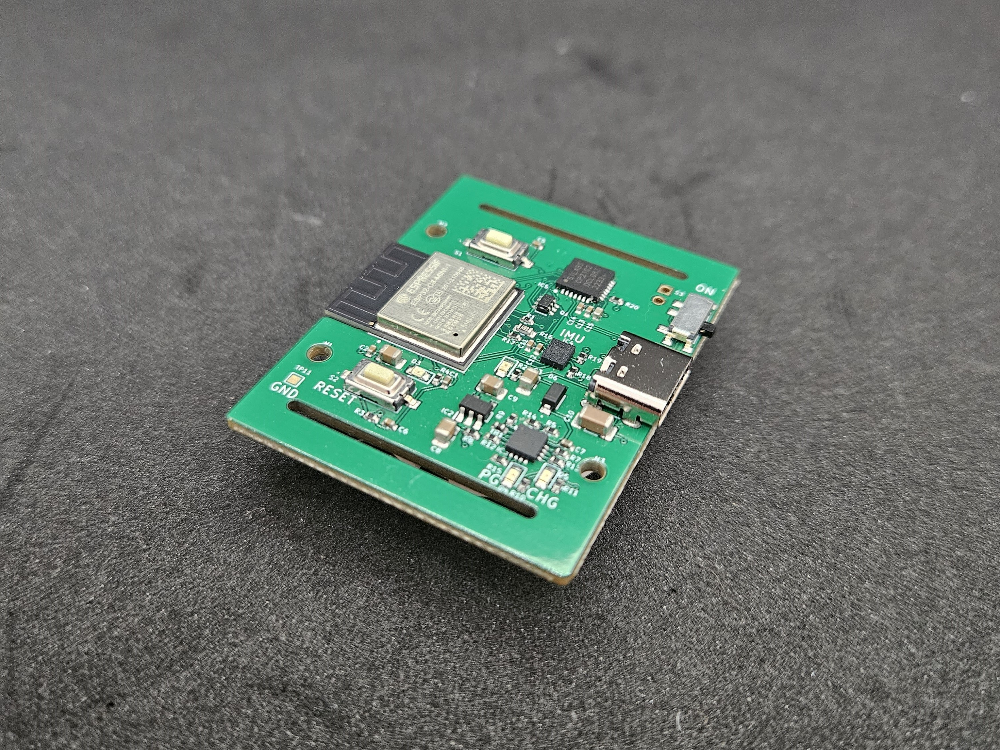

# Tracer: A Wearable for Things 🚀

## High-Level Summary

Introducing "Tracer" - a dynamic, open-source project built on the ESP-32 platform. Tailored for enthusiasts and innovators, Tracer taps into the vast array of software libraries available for the ESP-32. It offers a unique window into the intricate processes and algorithms behind creating a personalized fitness tracker.

---

## Detailed Description

### What is it?

Tracer is a versatile wearable designed for a myriad of applications. Whether you're a sports enthusiast wanting to analyze your tennis serve or a cyclist keen on understanding lean angles, Tracer provides invaluable insights. Key features include:

- **Real-time Object Tracking:** Utilize the LSM6DSL for precise motion capture.
- **Versatile Mounting:** High-quality velcro straps ensure adaptability, from monitoring lean angles on bicycles to analyzing tennis racquet poses.
- **Battery Management:** Efficient on-board Li-ion battery charging via the TP4065.
- **Extended Battery Life:** Up to 2.5 hours of continuous BLE streaming at 10Hz.
- **Proven Connectivity:** Boasts a 15m BLE range in open spaces, as tested on a tennis court.

---

## Use Cases

Tracer's design closely integrates with the Madgwick Filter, facilitating sensor fusion to estimate heading, roll, and pitch. This data can be transmitted to devices like smartphones or PCs for further analysis. Here are some applications:

## Use Cases

Tracer's design closely integrates with the Madgwick Filter, facilitating sensor fusion to estimate heading, roll, and pitch. This data can be transmitted to devices like smartphones or PCs for further analysis. Here are some applications:

- **Real-time 3D Visualization:** Stream data via UART to a script on [Processing](https://github.com/processing) for a 3D visual experience. Watch the demonstration [here](https://www.youtube.com/watch?v=f6d10yX7fZ4).

- **Stream to Phyphox:** Directly stream IMU plots over BLE to your phone. Export data as CSV for in-depth analysis, showcasing Tracer's capability to track accelerometer data and tennis ball strikes. Check out the live demo [here](https://www.youtube.com/watch?v=bZTHZ-QFxR4).

- **Gesture Recognition with Edge Impulse:** Highlighting Tracer's adaptability, the Edge Impulse platform can be employed to train a neural network. This network operates natively on the ESP32, tracking specific gestures or activities. See it in action [here](https://www.youtube.com/watch?v=aU7HlFeuip4).

---

## How to Run the Demo Script

1. **Setup:** Ensure you have the Arduino IDE installed on your computer.
2. **Connect:** Plug in your ESP32-C3 device to your computer via USB.
3. **Integrated JTAG:** Ensure the JTAG is setup. In Tools, "USB CDC On Boot" is Enabled and JTAG Adapter is USB JTAG Adapter.
5. **Load Script:** Open one of the demo script provided in the Arduino IDE.
6. **Select Board:** From the 'Tools' menu, select 'Board' and choose 'ESP32-C3'.
7. **Select Port:** Select the port for the Tracer device, if nothing pops up, unplug the device, hold the settings button and plug it back into the computer while still holding the button. It should appear now.
8. **Upload:** Click on the 'Upload' button to program the ESP32-C3.
9. **Monitor:** Open the Serial Monitor to view outputs and ensure the script runs successfully.

For any issues or further instructions, please refer to the documentation or raise an issue in the repo.

**Acknowledgments:** A special thank you to JLCPCB for their invaluable support in sponsoring this project. Their expertise has been instrumental, allowing for rapid prototyping without sacrificing quality.

---

## License

MIT License

Copyright (c) 2023 elektroThing

Permission is hereby granted, free of charge, to any person obtaining a copy
of this software and associated documentation files (the "Software"), to deal
in the Software without restriction, including without limitation the rights
to use, copy, modify, merge, publish, distribute, sublicense, and/or sell
copies of the Software, and to permit persons to whom the Software is
furnished to do so, subject to the following conditions:

The above copyright notice and this permission notice shall be included in all
copies or substantial portions of the Software.

THE SOFTWARE IS PROVIDED "AS IS", WITHOUT WARRANTY OF ANY KIND, EXPRESS OR
IMPLIED, INCLUDING BUT NOT LIMITED TO THE WARRANTIES OF MERCHANTABILITY,
FITNESS FOR A PARTICULAR PURPOSE AND NONINFRINGEMENT. IN NO EVENT SHALL THE
AUTHORS OR COPYRIGHT HOLDERS BE LIABLE FOR ANY CLAIM, DAMAGES OR OTHER
LIABILITY, WHETHER IN AN ACTION OF CONTRACT, TORT OR OTHERWISE, ARISING FROM,
OUT OF OR IN CONNECTION WITH THE SOFTWARE OR THE USE OR OTHER DEALINGS IN THE
SOFTWARE.
