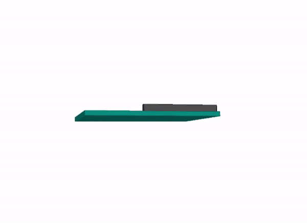

# Tracer - A Wearable for Things!

 
 The Tracer is an open-source ESP32-based Inertial Measurement Unit tracker that allows you to track the motion and orientation of objects and stream the data to your smartphone or computer.
 
 This repository contains the following content;
 - Schematic
 - Example code to get started with streaming data over Bluetooth (BLE) to your smartphone via [Phyphox](https://github.com/phyphox)
 - 3D Visualisation via Processing
 
 ## What is it
Have you ever wanted to just stick an IMU on a thing to trace its pose and motion?
Tracer provides reliable high-performance and cost efficient tracking of objects for a variety of applications. Tracer can be easily mounted using a high quality velcro strap, allowing it to be fastened on the frame of a bicycle for lean and cadence tracking or even the neck of a tennis racquet to count number of strokes and potentially differentiate between top spin and slice. Let you imagination run wild!

Leveraging on existing open-source projects the Tracer fully supports integration with Phyphox, and can be programmed using Micropython, and Arduino. Power users can also use the [ESP-IDF](https://github.com/espressif/esp-idf) tool for maximum customisation. 

Key Features;
- Leverage the [LSM6DSL](https://www.st.com/en/mems-and-sensors/lsm6dsl.html) to track your objects in real-time.
- Easy mounting using high quality velcro straps that allow the unit to be mounted on a wide variety of objects from your bicycle to track lean angles to an tennis racquet for pose insights.
- On-board Li-ion battery charging using the TP4065.
- 5 hours battery life at maximum sample rate of 100 Hz.
- 30m BLE range (unobstructed)

## Use cases

The example code used to test this design involves close integration with the [Madgwick Filter](https://ahrs.readthedocs.io/en/latest/filters/madgwick.html). Using that filter to perform sensor fusion and generate an estimate for heading, roll and pitch, the data can then be relayed to a smartphone or PC for post processing. See below for two example

### Real-time 3D Visualisation

This 3D visualisation is by streaming data over UART to a simple script that was written on [Processing](https://github.com/processing).

### Stream real-time data to phyphox 

The real-time plots from the IMU is streamed over BLE to the phone. Data can later be exported over CSV for further analysis if required. Phyphox is also capable of performing DSP which should offload any energy intensive computation from the ESP32.

## Specification
* Microcontroller | [ESP32-PICO-D4](https://www.espressif.com/en/producttype/esp32-pico-d4)
    * WiFi | 802.11b/g/n
    * Bluetooth | BLE 4.2
    * FLASH | 4MB
    * Programming | USB over UART (CP2104)
* Inertial Measurement Unit (IMU) | [LSM6DSLTR](https://www.st.com/en/mems-and-sensors/lsm6dsl.html)
    * Accelerometer | ±2/±4/±8/±16 g at 1.6 Hz to 6.7KHz
    * Gyroscope | ±125/±250/±500/±1000/±2000 dps at 12.5 Hz to 6.7 KHz
* Time-of-Flight (TOF) | [VL53L0X](https://www.st.com/en/imaging-and-photonics-solutions/vl53l0x.html)
    * Range | Up to 2m
    * 1D Gesture Recognition
* Li-ion Battery Management | TP4065
* Power | 700mA 3.3V LDO
* Mounting Options | Velcro Strap or 3x M.2.Screws

## License

MIT License

Copyright (c) 2022 elektroThing

Permission is hereby granted, free of charge, to any person obtaining a copy
of this software and associated documentation files (the "Software"), to deal
in the Software without restriction, including without limitation the rights
to use, copy, modify, merge, publish, distribute, sublicense, and/or sell
copies of the Software, and to permit persons to whom the Software is
furnished to do so, subject to the following conditions:

The above copyright notice and this permission notice shall be included in all
copies or substantial portions of the Software.

THE SOFTWARE IS PROVIDED "AS IS", WITHOUT WARRANTY OF ANY KIND, EXPRESS OR
IMPLIED, INCLUDING BUT NOT LIMITED TO THE WARRANTIES OF MERCHANTABILITY,
FITNESS FOR A PARTICULAR PURPOSE AND NONINFRINGEMENT. IN NO EVENT SHALL THE
AUTHORS OR COPYRIGHT HOLDERS BE LIABLE FOR ANY CLAIM, DAMAGES OR OTHER
LIABILITY, WHETHER IN AN ACTION OF CONTRACT, TORT OR OTHERWISE, ARISING FROM,
OUT OF OR IN CONNECTION WITH THE SOFTWARE OR THE USE OR OTHER DEALINGS IN THE
SOFTWARE.

